Markdown
# BÁO CÁO BÀI TẬP / ĐỒ ÁN

## THÔNG TIN SINH VIÊN
- **Họ và tên:** Nguyễn Trọng Hiếu
- **Mã số sinh viên:** 24810320307
- **Lớp:** D19QTANM1
- **Ngày nộp:** 08/10/2024
- **Tên môn học:** Lập trình C# / Windows Forms
- **Tên bài tập:** Ôn tập winforms ngày 8 tháng 10

---

# Screenshots

## Báo lỗi

### baoloibai1.png
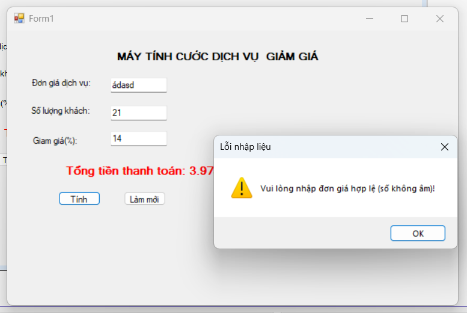

### baoloibai3.png
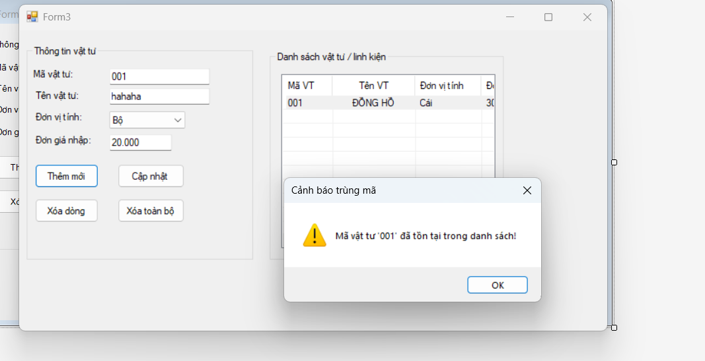

### baoloibai4.png
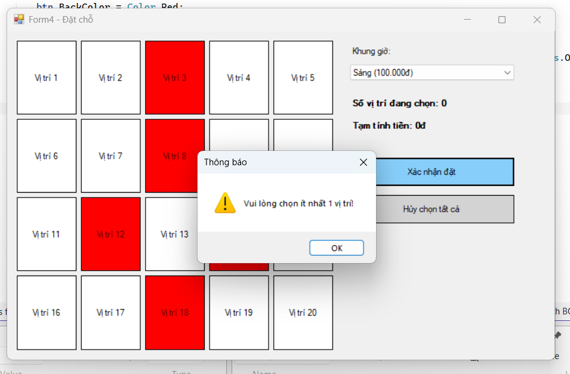

### baoloibai5.png
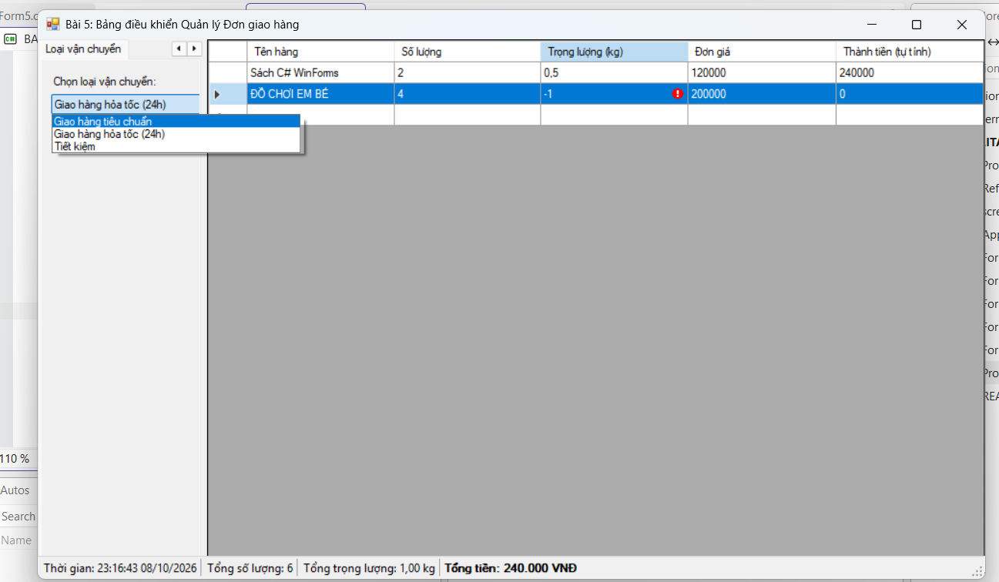

## Giao diện

### giaodienbai1.png
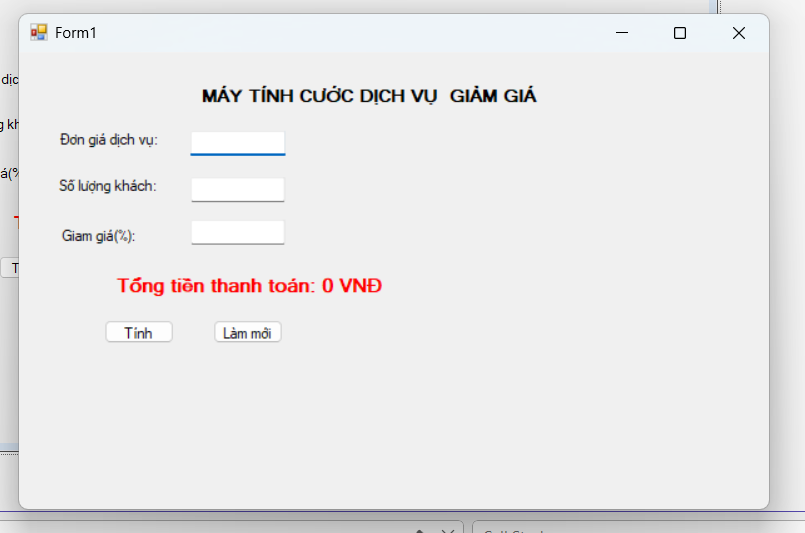

### giaodienbai2.png
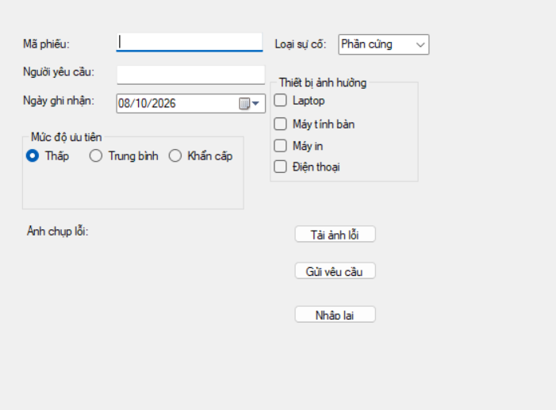

### giaodienbai3.png
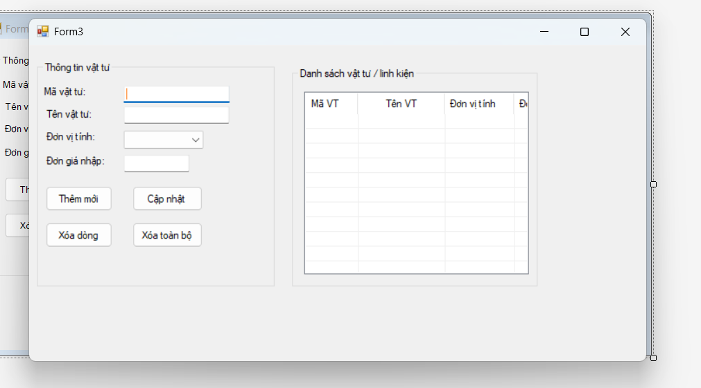

### giaodienbai4.png
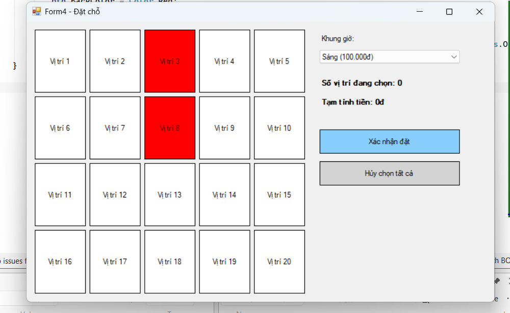

### giaodienbai5.png
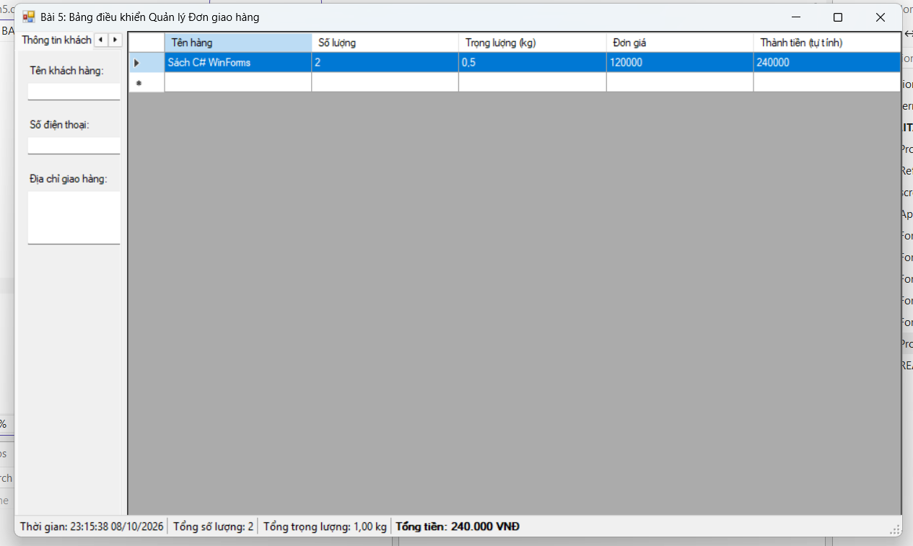

## Thực thi

### thucthibai1.png
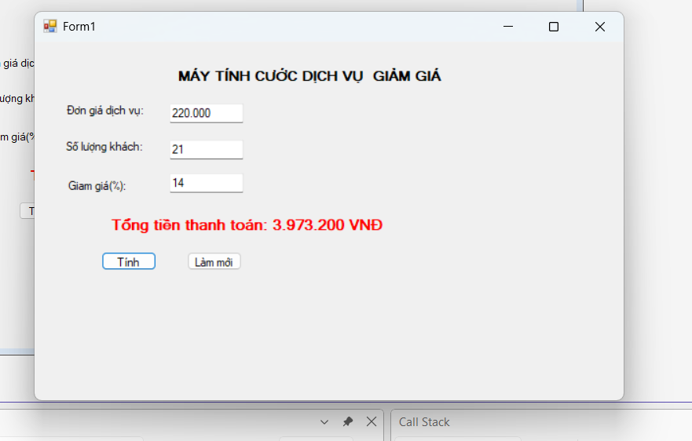

### thucthibai2.png
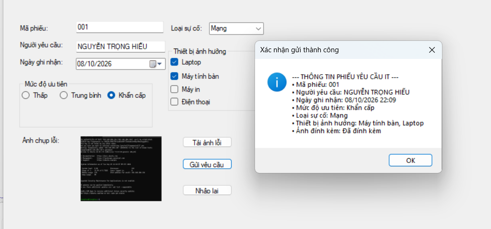

### thucthibai3.png
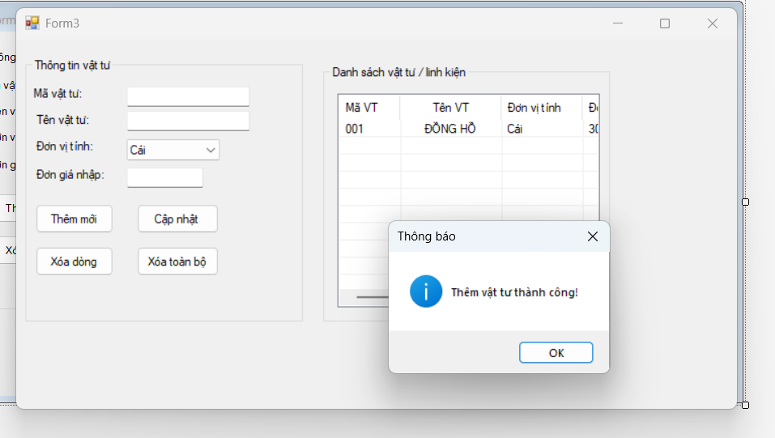

### thucthibai4.png
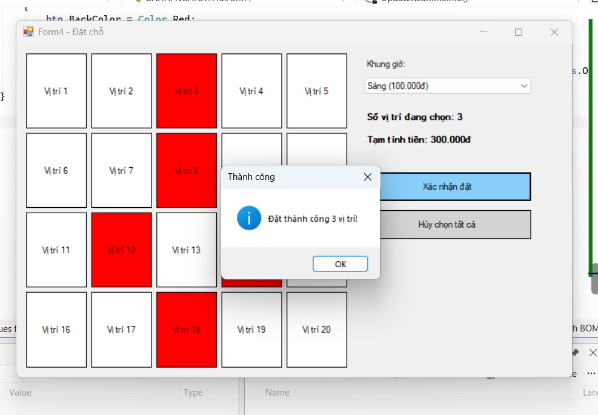

### thucthibai5.png
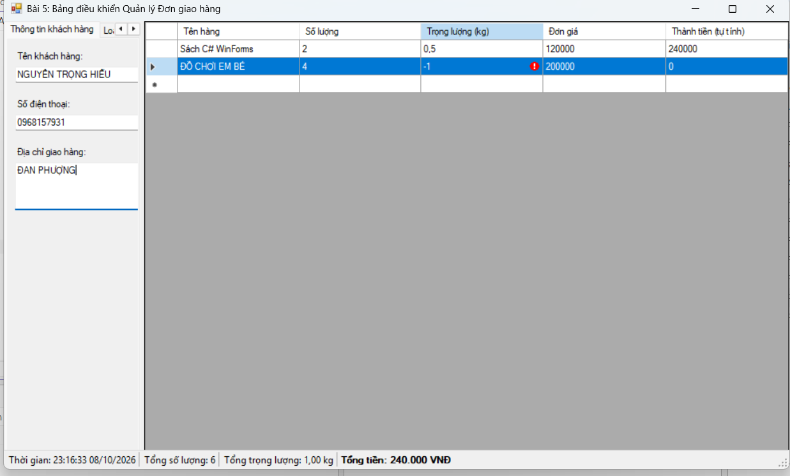
